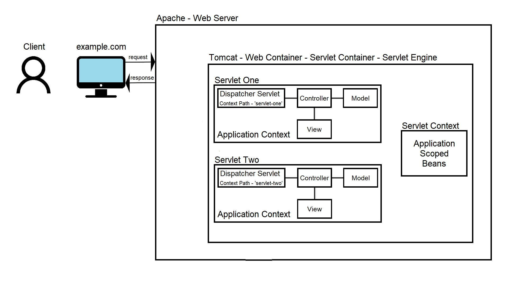

# [Spring Boot Application Scoped Bean](https://docs.spring.io/spring-framework/docs/current/javadoc-api/org/springframework/web/context/annotation/ApplicationScope.html)

[](https://www.oracle.com/java/technologies/javase/jdk14-archive-downloads.html)
[](https://mvnrepository.com/artifact/org.springframework.boot/spring-boot-starter-parent/2.3.10.RELEASE)
[](http://maven.apache.org/download.cgi)

## Content

- [Introduction](#introduction)
- [Getting Started](#getting-started)
- [Create the Configuration of the Project](#create-the-configuration-of-the-project)
- [Author](#author)

### Introduction <a name="introduction"></a>

This project is explaining how the Application Scope works on beans in the Spring Framework.



The static content is given to the client directly from the Apache web server. In order to serve dynamic content we need
to use servlets, or Spring Boot based APIs, which are deployed in a web container/servlet container/servlet engine, such
as Tomcat or Jetty. Each Spring Boot API run locally has its own Tomcat, but all of those are hosted on the local
laptop, which acts as the Apache web server, and goes by the localhost host name. That is why each Spring Boot based
API, has to be run on a different port. Using the context path, the Apache web server knows to which servlet to
propagate the request. Further more, the request is propagated to a component called a dispatcher servlet, which has a
responsibility to propagate the request to the correct endpoint. Another name for the dispatcher servlet is front
controller, and the logic of the request distribution to the correct endpoint is called a front controller pattern. Each
Spring Boot based API, when deployed, has its own dispatcher servlet. Another option to serve dynamic content is by
using an application server, such as Glassfish or JBoss. Application servers are usually used to host very big
applications, or very big distributed system of services.

### Getting Started <a name="getting-started"></a>

Before deploying the project to Apache Tomcat, the project needs to be build.

- Build the project.

```
    mvn clean install
```

Call the below links in the specific order, to see how the Application Scope works in the Spring Framework.
- The following 'http://localhost:8080/api_jva_spring_boot_application_scoped_bean/dispatcher-servlet-context-two/numbers' URL gives information that the number is '0' for both, the singleton scoped bean in the <strong>SECOND</strong> application's context, and the application scoped bean in the servlet's context.
- The following 'http://localhost:8080/api_jva_spring_boot_application_scoped_bean/dispatcher-servlet-context-one/numbers' URL will update the number to '5' for both, the singleton scoped bean in the <strong>FIRST</strong> application's context, and the application scoped bean in the servlet's context.
- If the following 'http://localhost:8080/api_jva_spring_boot_application_scoped_bean/dispatcher-servlet-context-two/numbers' URL is now called, the number will be '0' for the singleton scoped bean in the <strong>SECOND</strong> application's context, but the number will be '5' for the application scoped bean since it is the same servlet's context.

### Create the configuration of the project <a name="create-the-configuration-of-the-project"></a>

- Create the template by navigating to 'Run/Debug Configurations' - 'Templates' - 'Tomcat Server' - 'Local'.
- Configure the Apache Tomcat by navigating to 'Server' - 'Application server' - 'Configure...'.
    - Set up the 'Tomcat Home' path.
    - Set up the 'Tomcat base directory' path.
    - Set the necessary libraries by navigating to 'Libraries'.
- Deploy the WAR file by navigating to 'Deployment' - 'Deploy at the server startup'.
- Set up the application's context path to '/api_jva_spring_boot_application_scoped_bean' by navigating to 'Deployment' - 'Application context'.

### Author <a name="author"></a>

[Viktor Talevski](https://www.linkedin.com/in/viktor-talevski-a7366794)